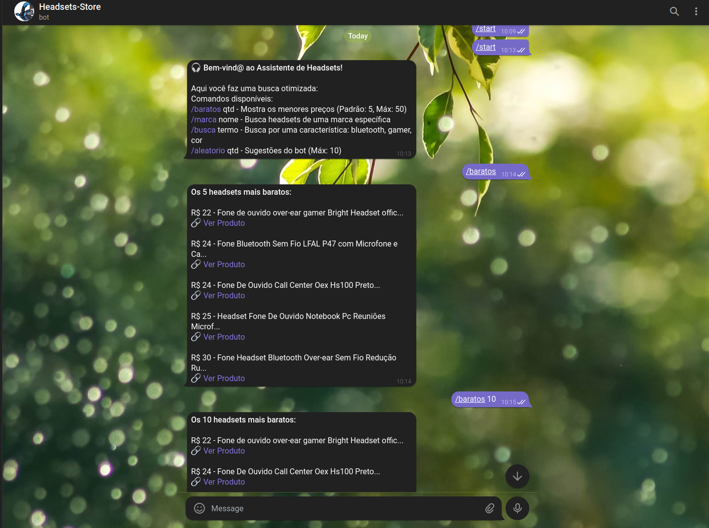
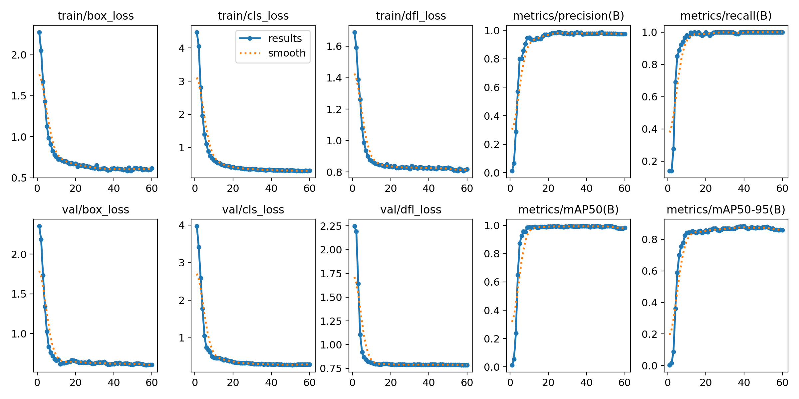

<h1 align="center"> Headsets Store</h1>
<p align="center"> Project that uses Computer Vision to collect data from headsets and make it available through a Bot on Telegram.</p>
<p align="center">
    
</p>

## About the Project

<p>Web scraping often returns "noisy" results (related products like stands or cables that are not the target). This project implements a hybrid architecture to ensure data integrity:</p>

- #### Visual Detection: A custom YOLOv11 model analyzes real-time screenshots to identify and locate three key elements: the headset image, the description, and the price.

- #### Smart Extraction: By using the coordinates provided by the AI, the system uses Selenium to extract text directly from those specific screen points, reducing reliance on HTML/CSS selectors.

- #### Storage: Validated data is stored in a PostgreSQL database hosted on Neon.tech;

- #### Interface: A Telegram Bot provides users with dynamic access to the stored data.

<p align="center">
    
</p>

## Machine Learning Model

<p> To perform the correct image detection, the following were used:</p>

- #### Dataset: 150 manually labeled images for the headset class;

- #### Computer Vision: the YOLOv11 model, developed by Ultralytics;

- #### Training: 60 epochs at 1024px resolution.

<p align="center">
    
</p>

## Running

- Clone the repository:

```sh
  git clone https://github.com/kenandjak/Headsets-Store
```

- Create a `.env` file based on the `.env.example` file containing your Neon.tech credentials and the BotFather token.

- Install the dependencies:

```sh
  pip install ultralytics selenium psycopg2-binary python-dotenv python-telegram-bot
```
